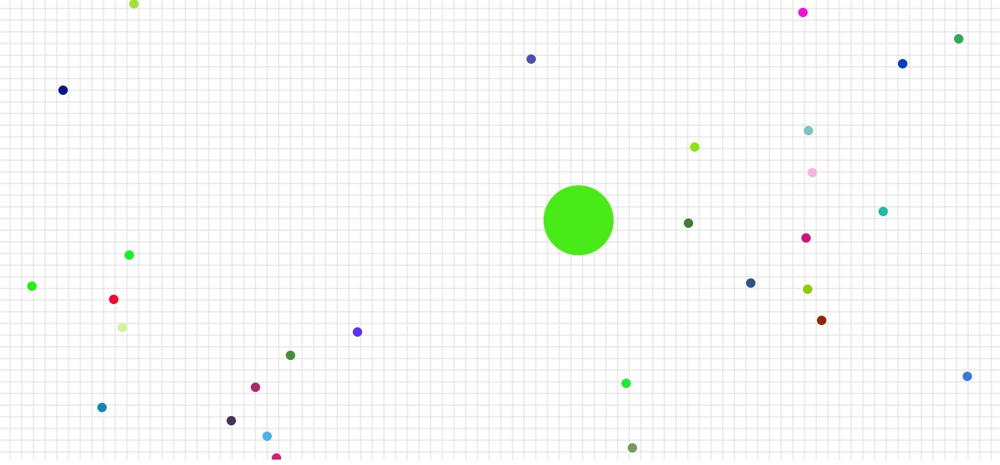

# Agario clone

clone of [agar.io](https://agar.io/)... it's just a very simple (and i mean ***very simple***) frontend (not even frontend but i dont have another word atm).... it's just a cell that grows when it eats the food.. and follows the mouse cursor. you can adjust the max size in the js file. still under development... suggestions and pull requests are welcome. 

<strong><a href="https://riyanswat.github.io/agario-clone/" target="_blank">Live demo on Github Pages</a></strong>

<br>

change the script tag in the html to the following line to see the responsive version in action in the demo:
```<script src="responsive_js.js"></script>```


<br>
<br>
here's a screenshot:


<br>
<br>

Electron JS implementation of this repo: https://github.com/riyanswat/agario-clone-electron/
